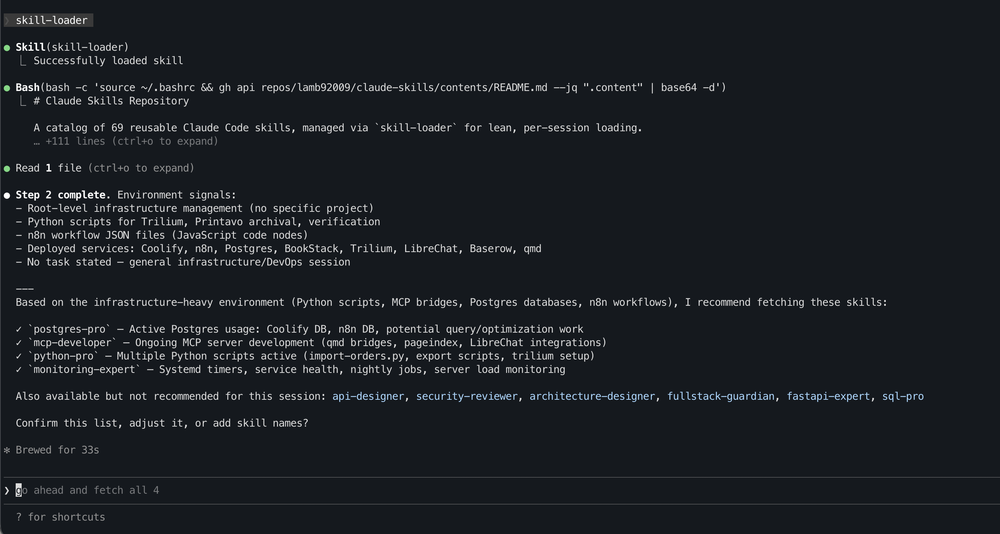

# claude-skill-loader

**On-demand skill loading for Claude Code** — fetch only what you need, keep your context window clean.

---

## The Problem

Claude Code skills are powerful, but loading all of them all the time creates two problems:

1. **Context bloat** — every skill loaded at startup consumes tokens before you've typed a word. If you have 30+ skills, a meaningful chunk of your context window is gone before the session starts.
2. **Manual pain** — the alternative (not loading anything and manually fetching skills when you need them) requires you to remember what skills exist and how to fetch them. That's cognitive overhead on every session.

There's a better way: a **catalog-driven, on-demand loader** that reads your skills repo at session start, looks at your project, and recommends only what's relevant. You confirm once, it fetches silently, and your context stays lean.

---

## How It Works

```
Session start
     │
     ▼
skill-loader fetches your catalog README from GitHub
     │
     ▼
Scans the project (CLAUDE.md, Dockerfile, package.json, stated task…)
     │
     ▼
Reasons against catalog descriptions → recommends 3–8 relevant skills
     │
     ▼
You confirm (or adjust) the list
     │
     ▼
Approved skills are fetched from GitHub into ~/.claude/skills/
     │
     ▼
A .session-skills manifest is written
     │
     ▼
Session ends → skill-cleanup reads manifest and removes fetched skills
```

**Permanent skills** (things like a brand reference or skills you use in every session) live locally at all times and are never fetched, never cleaned up, and never added to the manifest.

---

## Example Output

*skill-loader analyzing project context and recommending skills*



---

## Token Savings

Every skill loaded at startup contributes its description to Claude's system prompt — before you've typed a word. At scale this adds up fast.

| Scenario | Skills loaded | Description tokens |
|----------|--------------|-------------------|
| Always-on (101 skills) | 101 | ~5,000 |
| **With skill-loader** | | |
| → Baseline (permanent skills only) | 4–6 | ~250 |
| → After fetching session skills | +3–8 | ~400–650 total |

**Savings: ~4,350–4,600 tokens per session** just from descriptions alone.

Note: this is description tokens only — the `name` and `description` frontmatter that appears in Claude's skill list. The full skill content (the actual instructions) only loads into context when you explicitly invoke a skill. That cost is unchanged either way; skill-loader just ensures you're not paying the description overhead for skills you'll never touch this session.

---

## Setup

Before installing, open Claude Code and run this prompt. It will gather your configuration and install everything correctly:

```
I want to set up the claude-skill-loader system. Before we install anything,
I need to gather some information. Please ask me the following questions one
at a time and wait for my answer before proceeding:

1. What is your GitHub username?

2. What is the name of the repo where your skills are stored, or would you
   like to create a new one now?

3. Is your skills repo public? (The skill-loader fetches files via raw GitHub
   URLs, so it needs to be public or you need a token configured in the gh CLI)

4. Which skills, if any, should be permanently active and never cleaned up by
   skill-cleanup? (These are skills Claude should always have access to
   regardless of project — for example a brand reference or a skill you use
   in every session)

5. Do you already have skills in your repo, or would you like me to help you
   populate it from community sources like aitmpl.com or the
   everything-claude-code repository?

Once I have your answers I will:
- Install skill-loader and skill-cleanup into ~/.claude/skills/ configured
  for your specific repo
- Add the appropriate block to your ~/.claude/CLAUDE.md so skill-loader is
  suggested at the start of new projects
- If you don't have a skills repo yet, I will create one with a properly
  formatted README catalog that skill-loader can read
```

---

## Your Skills Repo README Format

The catalog README is what `skill-loader` reads to understand what skills exist and when to recommend them. The format must follow this exact table structure so the loader can reason against descriptions properly:

```markdown
## Category Name

| Skill | Description |
|-------|-------------|
| `skill-name` | Use when doing X. Invoke for Y, Z, and W. |
| `another-skill` | Use when building A. Invoke for B, C, and D. |
```

**Key rules:**

- Skill names must be in backticks in the first column
- Descriptions should start with **"Use when..."** and include **"Invoke for..."** — this phrasing is what the loader uses to reason about relevance
- Group skills into logical categories with `##` headings
- Skill names in the table must exactly match the folder names in your repo (`skill-name/SKILL.md`)

**Minimal working example:**

```markdown
# My Skills

## Development

| Skill | Description |
|-------|-------------|
| `tdd-guide` | Use when implementing any feature or bug fix. Invoke for test-first workflows, RED-GREEN-REFACTOR cycles, and coverage targets. |
| `code-reviewer` | Use when finishing a feature or before merging. Invoke for quality checks, security issues, and logic errors. |

## Infrastructure

| Skill | Description |
|-------|-------------|
| `docker-expert` | Use when containerizing applications or debugging Docker issues. Invoke for Compose files, multi-stage builds, and networking. |
```

---

## Adding Skills

**Three ways to add skills to your repo:**

### 1. Manually

Create a folder with a `SKILL.md` and update the catalog:

```
your-skills-repo/
  my-new-skill/
    SKILL.md          ← the skill instructions
    references/       ← optional: supporting reference docs
      cheatsheet.md
```

Then add a row to the README table. Claude Code will be able to fetch it next session.

### 2. Ask Claude Code to fetch from a community source

```
Fetch the "tdd-guide" skill from aitmpl.com and add it to my skills repo.
Update the README catalog with an appropriate description.
```

Or point it at the everything-claude-code repository for a wide selection of pre-built skills.

### 3. Capture patterns from a session

After solving a complex problem, ask:

```
That was a good solution. Please capture the key patterns and decision
framework as a new skill called "stripe-integration" and push it to my
skills repo with an appropriate catalog description.
```

---

## Community Skills Repos

- **[lamb92009/claude-skills](https://github.com/lamb92009/claude-skills)** — Reference implementation with 69+ skills across 8 categories: development, infrastructure, databases, AI/ML, business, frontend, project management, and Claude Code meta-skills. Good starting point to fork.

Have a public skills repo you'd like listed here? Open a PR.

---

## Skill File Format

Each skill is a folder in your repo containing a `SKILL.md`:

```markdown
---
name: skill-name
description: One-line description shown in Claude Code's skill list.
---

# Skill Title

Instructions for Claude on how to use this skill...
```

The frontmatter `name` and `description` are used by Claude Code's plugin system. The body is what Claude reads and follows when the skill is invoked.

---

## Contributing

Improvements welcome. Open an issue or PR for:

- Improvements to the skill-loader reasoning logic
- Better catalog README format suggestions
- Improvements to the setup prompt
- Additional community skills repo listings

The goal is to keep this minimal — a loader, a cleaner, and a setup guide. The skills themselves live in your own repo.

---

## License

MIT
